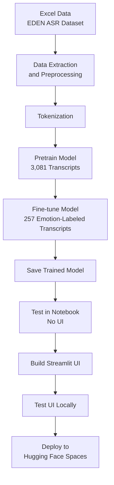

# System Diagram

Diagram to show the data flow and high level steps taken to go from the excel dataset to the deployed LLM application.

```mermaid
flowchart TD
    A[Excel Data<br/>EDEN ASR Dataset]
    B[Data Extraction<br/>and Preprocessing]
    C[Tokenization]
    D[Pretrain Model<br/>3,081 Transcripts]
    E[Fine-tune Model<br/>257 Emotion-Labeled Transcripts]
    F[Save Trained Model]
    G[Test in Notebook<br/>No UI]
    H[Build Streamlit UI]
    I[Test UI Locally]
    J[Deploy to<br/>Hugging Face Spaces]

    A --> B
    B --> C
    C --> D
    D --> E
    E --> F
    F --> G
    G --> H
    H --> I
    I --> J
```
